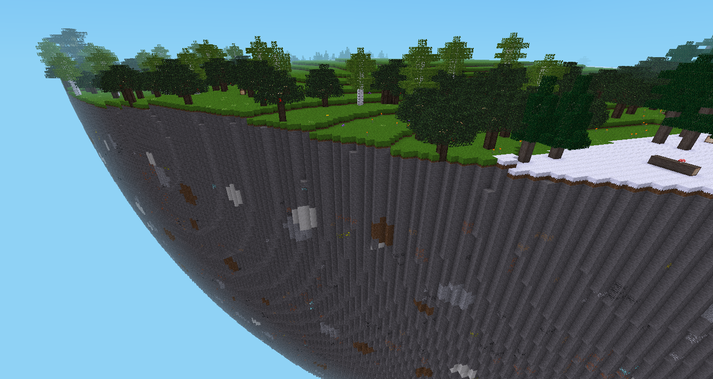
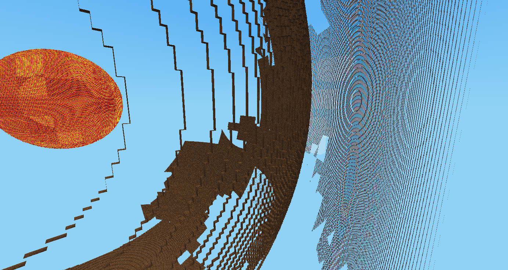

This mod generates planetoids at predefined positions


## Planet types

See: https://en.wikipedia.org/wiki/Star_Trek_planet_classification

* `class-m` earth like, flat (various dirt top layers and stone body)
* `class-n` all stone, flat
* `class-h` desert planet (desert-sand top layer and desert-sandstone body)
* `class-p` ice planet (snowblock top layer and ice body)
* `dyson-sphere` a dyson-sphere with a sun in its center
* `sun` single lava-like node

## Screenshots





## Api

### planetoidgen.register_planet(planet_def)

Registers a planet with type, size and position:

```lua
planetoidgen.register_planet({
  pos = { x=2500, y=7500, z=2500 },
  name = "my-planet",
  type = "class-m",
  radius = 300,
  airshell = true
})
```

### planetoidgen.register_planet_type(typename, mapgen_fn)

Registers a new planet type (see `/planettypes` for examples)

```lua
planetoidgen.register_planet_type("my-magic-planet", function(planet, minp, maxp)

	local vm, emin, emax = minetest.get_mapgen_object("voxelmanip")
	local data = vm:get_data()
	local area = VoxelArea:new{MinEdge=emin, MaxEdge=emax}

  -- magic here...

	vm:set_data(data)

	vm:set_lighting({day=15, night=0})
	vm:write_to_map()
end)

```
